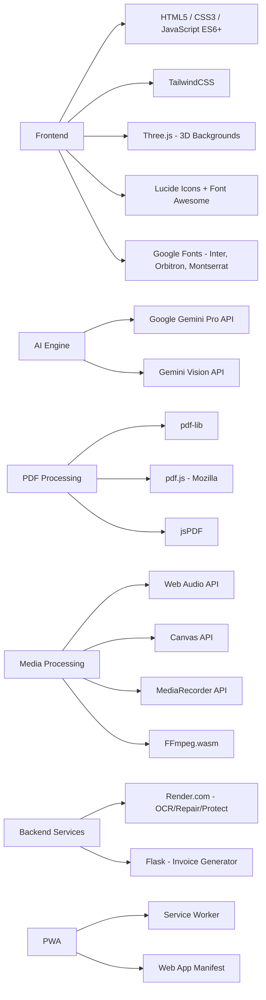

<p align="center">
  
</p>

<h1 align="center">🚀 PDF AI Toolkit</h1>

<p align="center">
  <strong>The Ultimate AI-Powered Document & Media Processing Suite</strong><br/>
  <em>150+ Professional Tools — PDF, Image, Video, Audio & Text — All in Your Browser</em>
</p>

<p align="center">
  <a href="#"></a>
  <a href="#"></a>
  <a href="#"></a>
  <a href="#"></a>
  <a href="#"></a>
</p>

<p align="center">
  <a href="#-quick-start">Quick Start</a> •
  <a href="#-tool-suites">Tool Suites</a> •
  <a href="#-architecture">Architecture</a> •
  <a href="#-ai-capabilities">AI Features</a> •
  <a href="#-security--forensics">Security</a> •
  <a href="#-contributing">Contributing</a>
</p>

---

## ✨ What is PDF AI Toolkit?

**PDF AI Toolkit** is a massive, browser-based document and media processing platform featuring **150+ professional-grade tools** organized across five interconnected suites. Powered by **Google Gemini AI**, it delivers intelligent document analysis, quality enhancement, and content generation — all while keeping your files **100% private** with client-side processing.

> **No uploads. No servers. No tracking.** Your documents never leave your browser.

### 🎯 Key Highlights

| Feature | Description |
|---------|-------------|
| 🧠 **AI-Powered Intelligence** | Gemini Pro integration for document summarization, Q&A chat, image enhancement, and background removal |
| 📄 **30+ PDF Tools** | Merge, split, compress, edit, sign, redact, watermark, convert, repair, OCR, and more |
| 🖼️ **24+ Image Tools** | Resize, crop, convert, enhance, forensic analysis, watermark, meme generator, passport photo maker |
| 🎬 **40+ Video Tools** | Trim, crop, filters, chroma key, screen recorder, steganography, subtitles, GIF conversion |
| 🎵 **52+ Audio Tools** | Equalizer, reverb, pitch shift, BPM detection, voice changer, binaural beats, text-to-speech |
| ✏️ **28+ Text Tools** | Base64, binary/hex conversion, lorem ipsum, password generator, diff checker, morse code |
| 🔄 **Workflow Automation** | Chain multiple tools into automated pipelines (e.g., Merge → Compress → Encrypt) |
| 📱 **Progressive Web App** | Installable on any device with offline support via service worker |
| 🎨 **3D Interactive UI** | Immersive Three.js animated backgrounds with glassmorphism design |
| 🔒 **Enterprise Security** | AES-256 encryption, digital signatures, steganography, forensic analysis |

---

## 🚀 Quick Start

### Prerequisites

- A modern web browser (Chrome, Firefox, Edge, Safari)
- No installation or backend required — **pure client-side app**

### Launch Locally

```bash
# Clone the repository
git clone https://github.com/Shashank-A-N/pdf-manager.git

# Navigate to the project
cd pdf-manager

# Open in browser (any static server works)
# Option 1: Python
python -m http.server 8000

# Option 2: Node.js
npx serve .

# Option 3: VS Code Live Server Extension
# Right-click index.html → "Open with Live Server"
```

Then visit **`http://localhost:8000`** in your browser.

### Install as PWA

Click the **"Install App"** button in the navigation bar or use your browser's install prompt to add PDF AI Toolkit to your device's home screen.

---

## 🛠️ Tool Suites

### 📄 PDF Tools (30+ Tools)

<details>
<summary><strong>🧠 AI-Powered</strong></summary>

| Tool | Description |
|------|-------------|
| **AI Summarizer** | NLP-powered document condensation using Gemini Pro |
| **Chat with PDF** | Interactive Q&A — upload any PDF and ask questions |
| **Image Enhancer** | AI upscaling, noise reduction, and color correction |
| **Background Remover** | Precision background removal using Gemini Vision |

</details>

<details>
<summary><strong>📁 Organization</strong></summary>

| Tool | Description |
|------|-------------|
| **Merge PDF** | Combine multiple PDFs with drag-and-drop reordering |
| **Split PDF** | Separate pages or extract ranges into new files |
| **Organize PDF** | Visual page management with drag-and-drop interface |
| **Remove Pages** | Delete unwanted pages to reduce file size |
| **Extract Pages** | Create new PDFs from selected pages |
| **Rearrange Pages** | Add page numbers and reorder sequences |
| **Scan to PDF** | Device camera capture with instant PDF conversion |
| **Compare PDF** | Side-by-side pixel-level difference highlighting |

</details>

<details>
<summary><strong>⚡ Optimization & Repair</strong></summary>

| Tool | Description |
|------|-------------|
| **Compress PDF** | Significant size reduction while maintaining quality |
| **Repair PDF** | Recovery of data from corrupt or damaged files |
| **OCR PDF** | Convert scanned documents to searchable text |

</details>

<details>
<summary><strong>🔄 Conversion</strong></summary>

| Direction | Formats |
|-----------|---------|
| **→ PDF** | Image (JPG/PNG/WEBP/TIFF), Word (DOCX), PowerPoint (PPTX), Excel (XLSX/CSV), HTML, Markdown |
| **PDF →** | Image (JPG/PNG/WebP), Word, PowerPoint, HTML, PDF/A (archival) |

</details>

<details>
<summary><strong>✏️ Editing & Customization</strong></summary>

| Tool | Description |
|------|-------------|
| **PDF Editor** | Full-featured editor — text, images, shapes, signatures |
| **Rotate PDF** | Permanent rotation (90°, 180°, 270°) |
| **Watermark** | Text/image watermark stamping for IP protection |
| **Crop PDF** | Trim margins or crop to specific selection areas |
| **E-Sign PDF** | Digital signature placement and management |

</details>

<details>
<summary><strong>🔒 Security & Forensics</strong></summary>

| Tool | Description |
|------|-------------|
| **Protect PDF** | AES-256 password encryption |
| **Unlock PDF** | Owner password and restriction removal |
| **Permissions** | Granular control — disable print, copy, or modify |
| **Redact PDF** | Permanent removal of sensitive information |
| **Secret Hider** | Steganographic text hiding within PDF structure |
| **Forensics Analyzer** | Metadata, hidden tags, and internal structure analysis |
| **Steganography Encoder** | Invisible data/watermark encoding |

</details>

<details>
<summary><strong>📋 Productivity</strong></summary>

| Tool | Description |
|------|-------------|
| **Smart Invoice Generator** | Professional invoice creation and export |
| **Markdown to PDF** | Convert Markdown documents to styled PDFs |
| **Secure Drop** | Encrypted peer-to-peer file sharing |
| **Workflow Chains** | Automated multi-tool pipelines |
| **PDF Flattener** | Flatten form fields and annotations |

</details>

---

### 🎵 Audio Tools (52+ Tools)

<details>
<summary><strong>Click to expand full audio tool list</strong></summary>

| Category | Tools |
|----------|-------|
| **Effects** | Reverb, Delay, Chorus, Distortion, Phaser, Flanger, Equalizer, Panner, Fade In/Out, Pitch Shifter, Speed Changer, Bass Booster, Treble Booster, Volume Booster |
| **Editing** | Audio Trimmer, Splitter, Joiner, Mixer, Normalizer, Reverse, Remove Silence |
| **Analysis** | BPM Finder, BPM Tapper, Key Detector, Spectrogram Viewer, Oscilloscope, Decibel Meter, Stereo Phase Meter, Audio Analysis Tool |
| **Generators** | Tone Generator, Noise Generator, Lo-Fi Noise, Binaural Beats, DTMF Generator, Rhythm Pattern Generator, Chord Generator, Metronome |
| **Conversion** | Format & Encoding Tools, 8D Converter, Mono-to-Stereo, Stereo-to-Mono, Text-to-Speech |
| **AI & Intelligent** | AI Audio Tools, Audio/Video Enhancer, Vocal Remover, Voice Changer |
| **Recording** | Audio Recorder |

</details>

---

### 🎬 Video Tools (40+ Tools)

<details>
<summary><strong>Click to expand full video tool list</strong></summary>

| Category | Tools |
|----------|-------|
| **Editing** | Video Cropper, Resizer, Splitter, Merger, Rotate, Flip, Reverse, Loop, Speed Controller, Subtitles |
| **Effects** | Video Filters, Blurring, Chroma Key, Volume Booster, Audio Replacer |
| **Conversion** | Video Converter, Video Encoder, Video to GIF, GIF to Video, Audio Extractor, Frame Grabber |
| **Security** | Video Watermark, Redactor, Steganography, Video Hasher, Metadata Scrubber, VideoVault (Encrypted Storage) |
| **Recording** | Screen Recorder, Webcam Recorder, SecureCam |
| **Analysis** | Metadata Viewer, Bitrate Calculator, Video Decoder |
| **Utilities** | PIP Enabler, Teleprompter, Thumbnail Generator, Video Sync, Compressor |
| **Workflow** | Video Workflow Automation |

</details>

---

### 🖼️ Image Tools (24+ Tools)

<details>
<summary><strong>Click to expand full image tool list</strong></summary>

| Category | Tools |
|----------|-------|
| **Editing** | Image Resizer, Multi-Crop, Rotater, Image Compressor |
| **Conversion** | Image Converter (HEIC/JPG/PNG/WebP), Image to PDF, PDF to Images, HTML to Image |
| **Enhancement** | AI Image Upscaler, AI Image Quality Enhancer, Background Remover, Image Background Changer |
| **Effects** | Black & White, Blur Face, Subtitles Overlay |
| **Security** | Image Watermark, Watermark Remover, Image Redact, Steganography Encoder, Forensic Analyzer |
| **Generators** | Meme Generator, Passport Photo Maker |

</details>

---

### ✏️ Text Tools (28+ Tools)

<details>
<summary><strong>Click to expand full text tool list</strong></summary>

| Category | Tools |
|----------|-------|
| **Encoding** | Base64 Encoder/Decoder, Binary Converter, Hex Converter, URL Encoder/Decoder, Morse Code Translator |
| **Conversion** | CSV to JSON, Format Conversion (JSON/XML/YAML/HTML/Markdown) |
| **Generators** | Lorem Ipsum, Password Generator, Slug Generator, ASCII Art Generator, Zalgo Glitch Text, Upside Down Text |
| **Editing** | Find & Replace, Text Cleaner, Text Repeater, Duplicate Line Remover, Line Sorter, Text Transformation (case changes) |
| **Analysis** | Character Frequency, Text Analysis, Text Diff Checker, Email Extractor, Search & Extraction |
| **Security** | Security & Cryptography Suite, Handwritten Text Generator |
| **Speech** | Text-to-Speech Generator |

</details>

---

## 🏗️ Architecture

```
pdf-manager/
├── index.html                 # 🏠 Main application entry (3,500+ lines)
├── script.js                  # ⚙️ Core engine — tool database, search, UI logic
├── styles.css                 # 🎨 Global stylesheet (103KB — full design system)
├── background3d.js            # 🌌 Three.js 3D animated backgrounds
├── categorize_tools.js        # 🏷️ Auto-categorization engine for tools
├── sw.js                      # 📦 Service Worker for PWA/offline support
├── manifest.json              # 📱 PWA manifest configuration
├── logo-final.png             # 🖼️ Application branding
│
├── ai-summery/                # 🧠 AI Summarizer (Gemini Pro)
├── Q&A_pdf/                   # 💬 Chat with PDF
├── imageQE/                   # ✨ AI Image Enhancer
├── imageBGR/                  # 🖼️ AI Background Remover
│
├── pdf-merger/                # 📎 Merge PDFs
├── pdf-split/                 # ✂️ Split PDFs
├── pdf-compress/              # 📦 Compress PDFs
├── pdf-editor/                # ✏️ Full PDF Editor
├── pdf-redaction/             # 🔒 Redact sensitive info
├── pdf-protect/               # 🛡️ AES-256 encryption
├── pdf-unlock/                # 🔓 Remove restrictions
├── ... (20+ more PDF tools)
│
├── E-Sign-PDF/                # ✍️ Digital signatures
├── Smart-Invoice-Generator/   # 🧾 Invoice creation (Python/Flask)
├── Markdown to PDF Converter/ # 📝 MD → PDF conversion
├── Secure-Drop/               # 🔐 Encrypted file sharing
├── PDF-Flattener/             # 📋 Flatten annotations
├── HEIC-Converter/            # 🔄 HEIC image conversion
│
├── audio tools/               # 🎵 52+ audio processing tools
│   ├── index.html             # Audio suite dashboard
│   ├── tools_array.js         # Auto-generated tool registry
│   └── ... (52 tool directories)
│
├── video tools/               # 🎬 40+ video processing tools
│   ├── index.html             # Video suite dashboard
│   ├── tools_array.js         # Auto-generated tool registry
│   └── ... (40 tool directories)
│
├── image tools/               # 🖼️ 24+ image processing tools
│   ├── index.html             # Image suite dashboard
│   ├── tools_array.js         # Auto-generated tool registry
│   └── ... (24 tool directories)
│
├── text tools/                # ✏️ 28+ text processing tools
│   ├── index.html             # Text suite dashboard
│   ├── tools_array.js         # Auto-generated tool registry
│   └── ... (28 tool directories)
│
├── workflow/                  # 🔄 Workflow automation engine
├── forensics_pro_Analyzer/    # 🔍 PDF forensics analyzer
├── PDF-Secret-Hider/          # 🕵️ Steganography tool
├── shared/                    # 🎨 Shared assets (particle backgrounds)
├── icons/                     # 📱 PWA icons
├── thumbnails/                # 🖼️ Tool preview thumbnails
├── tools-preview/             # 🎥 Video previews for tools
└── security-report.html       # 📊 Security audit page
```

### Tech Stack



---

## 🧠 AI Capabilities

The toolkit harnesses **Google Gemini Pro** for intelligent document processing:

| Capability | How It Works |
|------------|-------------|
| **Document Summarization** | Upload any PDF → Gemini Pro extracts and condenses key information into concise summaries |
| **Interactive Q&A** | Transform static documents into knowledge bases — ask natural language questions about content |
| **Image Enhancement** | AI-powered upscaling with automatic noise reduction, sharpening, and color correction |
| **Background Removal** | Gemini Vision precision segmentation for clean, artifact-free background removal |

---

## 🔒 Security & Forensics

Built with **enterprise-grade security** tools for professionals:

- **AES-256 Encryption** — Military-grade password protection for PDFs
- **Digital Signatures** — E-Sign documents with legally-binding signatures
- **Redaction Engine** — Permanently removes sensitive data from file structure (not just visual overlay)
- **Steganography Suite** — Hide messages inside PDFs, images, and videos invisibly
- **Forensics Analyzer** — Deep inspection of metadata, hidden tags, XMP data, and internal PDF structure
- **Permission Manager** — Granular control over printing, copying, and modification rights
- **Secure Drop** — End-to-end encrypted file sharing between peers
- **Video Vault** — Encrypted video storage with password protection
- **Metadata Scrubbing** — Remove all identifying metadata from media files

---

## 🎨 Design & UX

| Feature | Implementation |
|---------|---------------|
| **Glassmorphism UI** | Frosted glass panels with `backdrop-blur` and semi-transparent layers |
| **3D Interactive Background** | Three.js powered animated scenes with custom shaders |
| **3D Card Tilt** | Mouse-tracking `perspective()` transforms on tool cards |
| **Typewriter Animation** | Animated hero text: *"Transform Documents With Intelligent AI"* |
| **Hover Video Previews** | Lazy-loaded video demonstrations on desktop tool hover |
| **Mega Menu Navigation** | Multi-column dropdown menus categorized by function |
| **Dark Theme** | Deep slate-900 palette with purple/indigo accent system |
| **Responsive Design** | Mobile-first with breakpoints at sm/md/lg/xl |
| **PWA Install Prompt** | Native-feeling install experience across devices |
| **Keyboard Shortcuts** | `Ctrl+K` for search, `Escape` to close modals |

---

## 🔄 Workflow Automation

Create powerful automation chains by combining multiple tools into a single workflow:

```
Example Pipeline:
  📎 Merge PDFs → 📦 Compress → 🔒 Encrypt → 💧 Add Watermark
```

The **Workflow Engine** (`workflow/index.html`) lets you:
- **Chain tools** in custom sequences
- **Batch process** multiple files simultaneously
- **Save workflows** for repeated use
- **One-click execution** of complex pipelines

---

## 📡 Backend Services

While the majority of tools run **100% client-side**, a few resource-intensive operations use lightweight backend services hosted on **Render.com**:

| Service | URL | Purpose |
|---------|-----|---------|
| PDF Repair | `pdf-repair-t8zp.onrender.com` | Recover corrupt PDF files |
| OCR Engine | `ocr-pdf-riw6.onrender.com` | Tesseract-based text recognition |
| PDF Protect | `protect-pdf-gcfo.onrender.com` | AES-256 encryption service |
| PDF Unlock | `pdf-unlock-92qv.onrender.com` | Owner password removal |
| PPT → PDF | `ppt-to-pdf-wvv7.onrender.com` | PowerPoint conversion |
| PDF → PPT | `pdf-to-ppt-etbf.onrender.com` | PDF to PowerPoint slides |
| Invoice Generator | Local Flask server | Python-based invoice creation |

---

## 🤝 Contributing

Contributions are welcome! Here's how to get started:

1. **Fork** the repository
2. **Create** a feature branch: `git checkout -b feature/amazing-tool`
3. **Build** your tool in its own directory (e.g., `my-new-tool/index.html`)
4. **Register** it in `script.js` → `toolDatabase` object
5. **Add** a thumbnail in `thumbnails/` and preview video in `tools-preview/`
6. **Submit** a Pull Request

### Tool Structure Convention

Each tool follows a self-contained pattern:

```
my-tool/
├── index.html      # Complete tool (HTML + CSS + JS in single file)
└── (optional assets)
```

### Code Style

- **Single-file architecture** — each tool is a standalone HTML file
- **Consistent dark theme** — use the global palette (`#0f172a`, `#1e293b`, indigo/purple accents)
- **Responsive design** — mobile-first with TailwindCSS utilities
- **Zero external dependencies** where possible — leverage Web APIs

---

## 📊 Project Stats

| Metric | Value |
|--------|-------|
| **Total Tools** | 150+ |
| **Main Index** | 3,557 lines |
| **Stylesheet** | 103 KB |
| **Tool Suites** | 5 (PDF, Audio, Video, Image, Text) |
| **Backend Services** | 6 on Render.com + 1 Flask |
| **AI Models** | Gemini Pro + Gemini Vision |
| **Special Pages** | Security Audits, Legal, Manifesto, 3D Demo |

---

## 📜 License

This project is open source and available under the [MIT License](LICENSE).

---

## 👨‍💻 Author

<p align="center">
  <strong>Shashank A N</strong><br/>
  <a href="https://github.com/Shashank-A-N">
    
  </a>
</p>

---

<p align="center">
  <em>Built with ❤️ and a passion for making powerful tools accessible to everyone.</em><br/>
  <strong>⭐ Star this repo if you find it useful!</strong>
</p>
